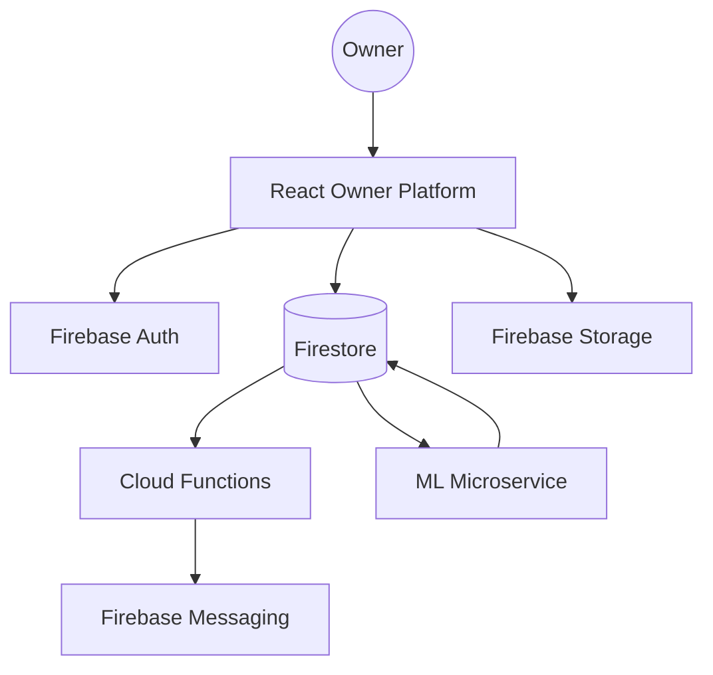

# EVPlugFinder Owner Platform Technical Specification

## 1. Overview
The Owner Platform (Partner Portal) is the operational backbone for EV charging station operators. It provides a real-time command center for monitoring station health, managing financial performance, and automating demand-driven pricing via AI.

### Core Objectives:
- **Operational Oversight**: Real-time monitoring of connector status and station health.
- **Financial Optimization**: Dynamic pricing and automated revenue management.
- **Customer Engagement**: Direct communication and feedback loops with drivers.
- **Scalability**: Multi-station management for large-scale operators.

---

## 2. System Architecture

The platform follows a modern serverless architecture leveraging Firebase for backend services and React for the frontend.

### Tech Stack:
- **Frontend**: React (Vite), Wouter (Routing), React Query (Data Fetching), Lucide React (Icons), Framer Motion (Animations).
- **Backend**: Firebase Authentication, Firestore (NoSQL Database), Firebase Storage (Media), Cloud Functions (Background triggers).
- **Styling**: Vanilla CSS / Tailwind (Glassmorphic design system).
- **State Management**: React Context (`AuthProvider`) for identity; React Query for server state.

### Architecture Diagram (High Level):

---

## 3. Routing & Navigation

All owner-specific routes are isolated under the `/owner` namespace.

| Route | Component | Purpose |
| :--- | :--- | :--- |
| `/owner/login` | `OwnerLogin` | Gateway for authenticated access. |
| `/owner/signup` | `OwnerSignup` | Registration for new station partners. |
| `/owner/complete-business-profile` | `OnboardingWizard` | Mandatory setup for business and payment details. |
| `/owner/dashboard` | `OwnerDashboard` | Live KPIs, alerts, and quick actions. |
| `/owner/stations` | `OwnerStations` | Management of station hardware and availability. |
| `/owner/ledger` | `OwnerLedger` | Financial transaction history and payouts. |
| `/owner/reviews` | `OwnerReviews` | Feedback monitoring and response system. |
| `/owner/promotions` | `OwnerPromotions` | Loyalty and discount configuration. |
| `/fleet` | `FleetManagement` | Commercial fleet operation portal. |

---

## 4. Data Models (Firestore)

### Owners (`/owners/{uid}`)
| Field | Type | Description |
| :--- | :--- | :--- |
| `uid` | `string` | Unique identifier (Firebase Auth UID). |
| `businessName` | `string` | Legal name of the operating entity. |
| `upiId` | `string` | Payment identifier for settlements. |
| `upiQrUrl` | `string` | URL to the payment QR code in Storage. |
| `autopilotEnabled`| `boolean`| Toggle for AI-driven pricing. |
| `operatingHours` | `map` | Weekly schedule for station access. |

### Stations (`/stations/{id}`)
| Field | Type | Description |
| :--- | :--- | :--- |
| `ownerId` | `string` | Reference to the owning partner. |
| `status` | `enum` | `active`, `maintenance`, `pending`, `offline`. |
| `connectors` | `array` | List of `Connector` objects (Type, Power, Price). |
| `lat`, `lon` | `number` | Geospatial coordinates. |
| `maintenanceRiskScore`| `number` | AI-calculated risk (0-100). |

### Bookings (`/bookings/{id}`)
| Field | Type | Description |
| :--- | :--- | :--- |
| `ownerId` | `string` | Denormalized owner ID for efficient querying. |
| `status` | `enum` | `confirmed`, `active`, `completed`, `cancelled`. |
| `totalPrice` | `number` | Final transaction amount. |
| `energyDeliveredKwh`| `number` | Total energy consumed during session. |

---

## 5. Core Features & Algorithms

### A. AI Autopilot (Revenue Optimizer)
The `autopilot-engine.ts` analyzes historical booking density to recommend surge pricing.
- **Confidence Formula**: `(SessionCount / 20) * 100` (Capped at 100%).
- **Demand Tiering**: If `AvgRevenue > OverallAvg * 1.3`, demand is 'High' (1.5x surge). Otherwise 'Moderate' (1.25x surge).
- **Automation**: When enabled, the system automatically applies these rules during peak hours.

### B. Health Check & Predictive Maintenance
- **Review Sentiment Trigger**: If a station receives 3+ reviews with rating ≤ 2 in 24h, it flags a `CONNECTOR_FAULT`.
- **Failure Analysis**: Monitors `HIGH_CANCELLATIONS` (3+ cancellations in 1h at a single site).
- **Risk Scoring**: Aggregates fault history and station age into a `maintenanceRiskScore`.

### C. Dynamic Surge Pricing
Owners can manually or automatically toggle peak pricing multipliers. This updates the `pricing` object on connectors, which the Driver App reads in real-time to calculate session costs.

---

## 6. Cloud Functions

Defined in `functions/index.js`:
- **`sendSessionCompleteNotification`**: Triggered on `bookings/{bookingId}` onUpdate. Detects status change to `completed` and sends a push notification to the driver via FCM.

---

## 7. Security Rules (IAM)

The `firestore.rules` file implements strict Role-Based Access Control (RBAC):

| Collection | Role | Permissions |
| :--- | :--- | :--- |
| `owners` | Owner | `read/write` (own profile) |
| `stations` | Owner | `read/write` (stations where `ownerId == auth.uid`) |
| `bookings` | Owner | `read` (where `ownerId == auth.uid`) |
| `chats` | Owner | `read/write` (where `ownerId == auth.uid`) |
| `telemetry` | Owner | `create/read` (monitoring their own hardware) |

---

## 8. Integration Points
- **Maps**: Mapbox GL integration for station geolocation.
- **Payments**: UPI integration via QR code displays and transaction ledgering.
- **Notifications**: Firebase Cloud Messaging (FCM) for real-time hardware and session alerts.
- **Competitor Insights**: Proximity-based polling of public station data for pricing parity analysis.

---

## 9. Intelligence & Analytics Dashboard

The Owner Dashboard utilizes a real-time intelligence layer to provide actionable operational insights:

### A. Competitor Awareness Engine
- **Logic**: Scans the `stations` collection for `active` stations within a **5km radius** (Haversine formula).
- **Metrics**: Surfaces competitor pricing per kWh and real-time connector availability.
- **Strategic Insights**: Triggers surge pricing recommendations when 60% or more of nearby competitor connectors are occupied.

### B. Revenue & Performance KPIs
- **Revenue Milestones**: Automated triggers celebrate financial targets (₹10k, ₹50k, etc.) to drive owner engagement.
- **Driver Retention**: Calculates "Returning Drivers" percentage by analyzing historical `bookings` for recurring `userId` patterns.
- **Growth Trends**: 30-day rolling revenue and session frequency comparison.

---

## 10. Proactive Notification System

Located at `/owner/notifications`, this centralized alert center manages the operational lifecycle of the network:

| Alert Category | Trigger Condition | Primary Action |
| :--- | :--- | :--- |
| **New Booking** | New doc in `bookings` | View Session Details |
| **High Risk** | `maintenanceRiskScore > 70` | Schedule Inspection |
| **Revenue** | Milestone reached | View Ledger |
| **Fault Alert** | Connector status -> `faulty` | Create Repair Order |

### Glassmorphic UI Architecture
The notification hub uses a high-fidelity glassmorphic design (`backdrop-blur-3xl`, `bg-white/5`) to ensure a premium dashboard experience across mobile and desktop.
