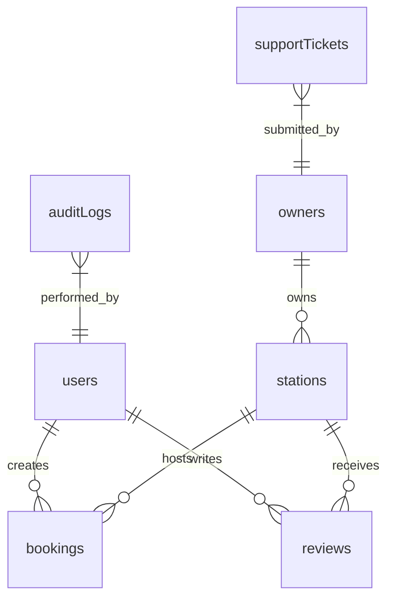
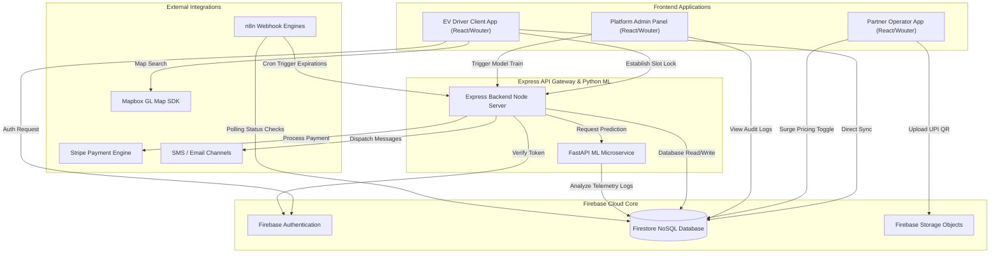

# EVPlugFinder EV Charging Platform — Comprehensive Systems Architecture & Integration Report

This document provides a detailed overview of the system architecture, code organization, database implementations, API specifications, and machine learning models of the EVPlugFinder SaaS EV Charging platform.

---

## 1. Project Directory Structure

Below is the tree view of the EVPlugFinder monorepo showing all major folders and important configuration files with their purpose:

```
EVPlugFinder Monorepo (d:\SeniorDevOps)
├── .github/                      # CI/CD deployment pipelines (actions/workflows)
├── .agents/                      # Autonomous coding agent configuration and skill definitions
├── client/                       # Frontend SPA React Application
│   ├── public/                   # Static assets, logos, and PWA icons
│   └── src/                      # Frontend Application Source Code
│       ├── assets/               # Local images, SVG icons, and typography files
│       ├── components/           # Reusable React components (gated by UI/Owner/Admin zones)
│       │   ├── charts/           # Custom Recharts wraps for dashboard metrics
│       │   ├── owner/            # Visual dashboard tools specifically for charging operators
│       │   ├── ui/               # Modular UI component kits (Shadcn layout wraps)
│       │   └── ...               # Shared driver-facing interface components
│       ├── hooks/                # Custom React Hooks (offline capability, active sessions, location)
│       ├── lib/                  # Context providers, helper algorithms, and client API services
│       ├── pages/                # Lazy-loaded router pages for User, Owner, and Admin views
│       │   ├── admin/            # Nested panels for administration operations (ML, Fraud, etc.)
│       │   ├── owner/            # Station manager subpages
│       │   └── ...               # Consumer (EV Driver) pages
│       ├── App.tsx               # Main React entrypoint, routing paths, and providers
│       ├── index.css             # Root Tailwind styles and custom glassmorphism design tokens
│       └── main.tsx              # Application client-side DOM mounting file
├── server/                       # Backend Node.js Express Application
│   ├── firebase-admin.ts         # Secure Firestore and Auth SDK configuration wrapper
│   ├── index.ts                  # HTTP Server bootstrapping, middleware setup, and Dev server proxy
│   ├── notifications.ts          # Alert dispatching controller supporting SendGrid and Twilio
│   ├── routes.ts                 # Express Route gateway handler, proxy targets, and scheduler loops
│   ├── storage.ts                # Abstract storage layer interface and mock database mockups
│   └── vite.ts                   # Development server configuration for Hot Module Replacement (HMR)
├── shared/                       # Models and validation schemas shared between Client & Server
│   └── schema.ts                 # Zod validation models and types for database entities
├── ml_service/                   # AI/ML Prediction and Recommendations Engine (FastAPI)
│   ├── models/                   # Serialized ML model binaries (.pth, .pkl files)
│   ├── src/                      # ML pipelines, features, and model definition code
│   │   ├── features/             # Feature engineering pipelines and geolocational metrics
│   │   ├── models/               # Model training modules and predictive fallback strategies
│   │   └── monitoring/           # Latency metrics logger and drift performance trackers
│   ├── main.py                   # FastAPI service engine entrypoint
│   └── requirements.txt          # Python virtual environment library dependencies
├── simulator/                    # Occupancy simulator for testing hardware streams
│   ├── run_simulator.py          # Script generating mock occupancy & writing to Firestore/JSON
│   └── requirements.txt          # Python packages list for the simulator
├── firestore.rules               # Granular Role-Based Access Control database validation rules
├── firestore.indexes.json        # Composite indices mapping for Firestore querying
├── storage.rules                 # Cloud Storage object access validation logic
├── package.json                  # Node.js project scripts and dependencies configuration
├── tsconfig.json                 # TypeScript compiler parameters
├── tailwind.config.ts            # Theme definitions and responsive breakpoints
└── vite.config.ts                # Vite module bundler rules
```

---

## 2. Frontend Client Architecture Analysis

The frontend of EVPlugFinder is a highly polished, responsive Single Page Application (SPA) structured around a glassmorphism design system.

### 2.1 Route Map & Guards
Routing is handled client-side using `wouter`. The application is divided into three distinct routing flows based on roles in `client/src/App.tsx`:

1.  **Consumer (EV User) Flow**:
    *   `/` — `Home`: Interactive Mapbox GL charging station discovery view.
    *   `/station/:id` — `StationDetail`: Station features, real-time connector slots, and user review list.
    *   `/bookings` — `Bookings`: Personal booking history, active timers, and QR code access codes.
    *   `/active-charge` — `ActiveCharge`: Real-time session metrics tracking SOC battery percentage and power delivery.
    *   `/complete-profile` — `CompleteProfile`: Mandatory onboarding wizard to capture driver details and EV garage information.
    *   `/referral` — `ReferralPage`: Gamified loyalty tracker showing referral code sharing status.
    *   `/routes` — `RoutePlanner`: Geospatial planning mapping battery depletion across waypoints.

2.  **Partner (Owner) Flow**:
    All operator actions are isolated under `/owner/*` and rendered within the `OwnerLayout` sidebar container:
    *   `/owner/login` & `/owner/signup` — Direct partner credentials access pages.
    *   `/owner/complete-business-profile` — UPI and business data setup forms.
    *   `/owner/dashboard` — Live operational command hub tracking surge multipliers, revenue targets, and chat streams.
    *   `/owner/stations` — CRUD dashboard to modify station hours, pricing per kWh, and connector status.
    *   `/owner/ledger` — Financial statement analyzer mapping gross transactions and platform commission cuts.

3.  **Administrator Flow**:
    All operations pages are nested under `/admin/*`:
    *   `/admin` — `AdminPanel`: Core dashboard summarizing active sessions, approvals, and anomaly alert boards.
    *   `/admin/support` — `AdminSupport`: Helpdesk ticketing client with SLA timers.
    *   `/admin/ml-monitoring` — `AdminMLMonitoring`: Model accuracy analytics.
    *   `/admin/predictive-maintenance` — `AdminPredictiveMaintenance`: Visual map flagging high-risk chargers.
    *   `/admin/fraud-detection` — `AdminFraudDetection`: Tracking velocity bookings and geographic anomalies.
    *   `/admin/settings` — `AdminSettings`: Platform commission slider, scheduled maintenance windows, and database wipe locks.

#### Router Guard Implementation
Access limits are verified directly within each page using the role state in `AuthContext`:
```tsx
const { user, userRole, loading } = useAuth();
const [location, setLocation] = useLocation();

useEffect(() => {
  if (!loading && (!user || userRole !== "admin")) {
    setLocation("/");
  }
}, [user, userRole, loading]);
```

### 2.2 Global State Context Providers
The client mounts three global React Contexts at root:
1.  **`AuthProvider`** (`client/src/lib/auth-context.tsx`): Subscribes to Firebase `onAuthStateChanged`, retrieves matching documents from the `users` and `owners` collections, resolves role bindings, and manages user onboarding redirection locks.
2.  **`LanguageProvider`** (`client/src/lib/language-context.tsx`): Controls internationalization parameters (English, Hindi, Marathi, etc.) storing selections in browser local storage.
3.  **`ThemeProvider`** (`client/src/lib/theme-provider.tsx`): Toggles dark and light mode UI aesthetics by modifying CSS body class variables.

### 2.3 Modular Shared Components
Visual widgets are isolated in `client/src/components/` to facilitate code reuse:
*   **`ActiveSessionWidget.tsx`**: Dynamic header drawer notifying drivers of currently active charges.
*   **`BusyTimesHeatmap.tsx`**: Graphical representation of hourly station occupancy based on historic logs.
*   **`PriceComparisonDrawer.tsx`**: Side-by-side pricing metrics showing competitor rates in proximity.
*   **`NFCCheckInButton.tsx`**: NFC Web API interface mapping direct physical check-ins at charger locks.
*   **`BatteryPlannerOverlay.tsx`**: Floating panels providing battery depletion warnings during route configuration.

---

## 3. Backend Express Server Architecture Analysis

The backend acts as a trusted gateway proxying heavy AI computations, verifying Stripe payments, and executing administrative maintenance tasks.

### 3.1 Server Organization
*   **`server/index.ts`**: Express configuration bootstrapping. Loads Middlewares (CORS, body-parser, compression, static assets serving in production) and configures the dev proxy pipeline.
*   **`server/routes.ts`**: Contains route controllers mapping. Handles background cron intervals checking for support SLAs, database drift anomalies, and station approvals.
*   **`server/storage.ts`**: Defines the `IStorage` data retrieval interface, mapping mock methods for local execution.
*   **`server/firebase-admin.ts`**: Initializes the connection using Google Service Account credentials:
```typescript
import admin from "firebase-admin";

const creds = process.env.FIREBASE_ADMIN_CREDENTIALS 
  ? JSON.parse(process.env.FIREBASE_ADMIN_CREDENTIALS) 
  : undefined;

if (creds && !admin.apps.length) {
  admin.initializeApp({
    credential: admin.credential.cert(creds),
    databaseURL: `https://${creds.project_id}.firebaseio.com`
  });
}
export const db = admin.apps.length ? admin.firestore() : null;
export const auth = admin.apps.length ? admin.auth() : null;
```

### 3.2 Notification Service (`server/notifications.ts`)
The server encapsulates communication with **Twilio** (SMS) and **SendGrid** (Email) inside a notification class. To prevent spam and reduce messaging fees, a custom Firestore rate-limiting mechanism is integrated:

*   **SMS Cap**: Max 10 messages per hour. Evaluated on `system_stats/notification_limits` inside a database transaction.
*   **Email Cap**: Max 50 emails per day.
*   **Notification Batching**: Rapid alert notifications (such as sequential security violations) are held in an in-memory queue for 5 seconds and combined before dispatching.

---

## 4. Database Firestore Analysis

EVPlugFinder utilizes Firestore as its primary operational database. Schemas are validated via **Zod** models at the application level.

### 4.1 Collections & Schema Overview

| Collection Name | Document Path Key | Key Schema Fields |
| :--- | :--- | :--- |
| **`users`** | `users/{uid}` | `email`, `role`, `displayName`, `phoneNumber`, `loyaltyPoints`, `referredBy`, `referralCode` |
| **`owners`** | `owners/{uid}` | `businessName`, `upiId`, `upiQrUrl`, `autopilotEnabled`, `verified`, `suspended` |
| **`stations`** | `stations/{id}` | `ownerId`, `name`, `lat`, `lon`, `status`, `connectors[]`, `maintenanceRiskScore` |
| **`bookings`** | `bookings/{id}` | `userId`, `stationId`, `connectorId`, `startTime`, `status`, `totalPrice`, `lockExpiresAt` |
| **`reviews`** | `reviews/{id}` | `stationId`, `userId`, `rating`, `comment`, `bookingId`, `sentiment` |
| **`supportTickets`** | `supportTickets/{id}` | `subject`, `status`, `priority`, `ownerId`, `adminResponse`, `internalNotes[]`, `createdAt` |
| **`auditLogs`** | `auditLogs/{id}` | `action`, `severity`, `performedBy`, `targetId`, `targetType`, `metadata`, `timestamp` |
| **`adminMetrics`** | `adminMetrics/{id}` | `date`, `score`, `grade`, `issueCount`, `savedAt` |
| **`ml_predictions`**| `ml_predictions/{id}` | `model`, `inputs`, `prediction`, `confidence`, `latency_ms`, `timestamp` |

### 4.2 Entity Relationships



### 4.3 Database Rules (`firestore.rules`)
Access controls are restricted using user attributes extracted from Auth Tokens:

*   **Helper Functions**:
    ```javascript
    function isLoggedIn() {
      return request.auth != null;
    }
    function isAdmin() {
      return isLoggedIn() && (
        request.auth.token.admin == true ||
        get(/databases/$(database)/documents/users/$(request.auth.uid)).data.role == 'admin'
      );
    }
    function isOwner() {
      return isLoggedIn() && exists(/databases/$(database)/documents/owners/$(request.auth.uid));
    }
    function isOwnerOf(stationId) {
      return isOwner() && get(/databases/$(database)/documents/stations/$(stationId)).data.ownerId == request.auth.uid;
    }
    ```
*   **Access Protections**:
    *   `auditLogs` & `adminMetrics`: Write block; Read restricted to `isAdmin()`.
    *   `stations`: Public read access for `approved` status; Write restricted to admins or corresponding owners.
    *   `bookings`: Reads permitted only for the user who booked or the owner who hosts the station.

### 4.4 Composite Indexes (`firestore.indexes.json`)
Custom compound indices are deployed to support sorting on complex queries:
*   `audit_logs`: `severity ASC, timestamp DESC` (Admin dashboard log tracking).
*   `supportTickets`: `status ASC, createdAt DESC` (Customer service queue triage).
*   `bookings`: `status ASC, startTime DESC` (Filtering driver histories).

---

## 5. API Reference Documentation

### 5.1 Express Server Gateway Routes

| Endpoint | Method | Request Payload | Response Body | Source File | Purpose |
| :--- | :--- | :--- | :--- | :--- | :--- |
| `/api/stations/nearby` | `GET` | *Query params*: `lat`, `lon`, `radius_km` | `Station[]` | `server/routes.ts` | Retrieve nearby active stations with ML availability scores. |
| `/api/bookings` | `POST` | `InsertBookingSchema` | `Booking` | `server/routes.ts` | Establish a 10-minute slot reservation lock. |
| `/api/webhook/payment` | `POST` | `bookingId`, `status` | `{ success: boolean, booking }` | `server/routes.ts` | Process payment gateway webhook simulations. |
| `/api/ml/predict-availability`| `POST`| `station_id`, `timestamp` | `{ prediction, confidence, metadata }` | `server/routes.ts` | Proxy to ML service with historical failover heuristics. |
| `/api/ml/predict-eta` | `POST` | `distance`, `traffic_index`, `temperature`, `timestamp` | `{ prediction, confidence }` | `server/routes.ts` | Retrieve LightGBM travel time forecasts. |
| `/api/ml/batch-predict` | `POST` | `user_id`, `user_location`, `station_ids` | `RankedStation[]` | `server/routes.ts` | Get SVD-based customized station rankings. |
| `/api/admin/retrain-trigger` | `POST` | `{}` | `{ status: string }` | `server/routes.ts` | Trigger background model training. |
| `/automation/hold-bookings` | `GET` | None | `Booking[]` | `server/routes.ts` | Fetch unpaid bookings exceeding the lock period. |
| `/automation/cancel-booking/:id`|`PUT` | None | `{ success: boolean }` | `server/routes.ts` | Cancel expired locks. |
| `/automation/free-slot/:id` | `PUT` | None | `{ success: boolean }` | `server/routes.ts` | Release connector lock. |
| `/api/apply-referral` | `POST` | `userId`, `referralCode` | `{ success: boolean }` | `server/routes.ts` | Execute referral transaction. |

### 5.2 FastAPI ML Service Routes

| Endpoint | Method | Request Payload | Response Body | Source File | Purpose |
| :--- | :--- | :--- | :--- | :--- | :--- |
| `/predict-availability` | `POST` | `station_id`, `timestamp` | `{ prediction: float, confidence: float }` | `ml_service/main.py` | Run PyTorch LSTM model on historical occupancy. |
| `/predict-eta` | `POST` | `distance`, `traffic`, `temp`, `timestamp` | `{ prediction: float, confidence: float }` | `ml_service/main.py` | Execute LightGBM travel time predictor. |
| `/get-cf-score` | `POST` | `user_id`, `station_id` | `{ score: float, is_cold_start: bool }` | `ml_service/main.py` | Compute Collaborative Filtering recommendation metrics. |
| `/rank-stations` | `POST` | `user_id`, `user_location`, `stations[]` | `{ ranked_stations: Station[] }` | `ml_service/main.py` | Compute final Meta-Ranker weight allocations. |
| `/health` | `GET` | None | `{ status: "healthy", models_loaded[] }` | `ml_service/main.py` | Run service health check. |

---

## 6. AI/ML Module Deep-Dive Analysis

EVPlugFinder's intelligent features are powered by a FastAPI microservice containing 4 models:

```
                  ┌───────────────────────┐
                  │   FastAPI Gateway     │
                  └───────────┬───────────┘
                              │
       ┌──────────────────────┼──────────────────────┬──────────────────────┐
       ▼                      ▼                      ▼                      ▼
┌──────────────┐       ┌──────────────┐       ┌──────────────┐       ┌──────────────┐
│  LSTM Model  │       │  LightGBM    │       │   SVD CF     │       │ Meta Ranker  │
│ Availability │       │  Travel ETA  │       │ Recommender  │       │  Classifier  │
└──────────────┘       └──────────────┘       └──────────────┘       └──────────────┘
```

### 6.1 Model Definitions
1.  **LSTM Availability Predictor** (`lstm_availability.pth`):
    *   **Architecture**: Recurrent Neural Network (RNN) capturing temporal dependencies.
    *   **Features**: Takes 12 sequence intervals (30 minutes each, representing the last 6 hours of occupancy) combined with time vectors (hour of day, day of week encoded as sine/cosine components).
    *   **Output**: Probability score indicating slot availability at the target hour.
2.  **LightGBM Travel ETA** (`eta_lgb_model.pkl`):
    *   **Architecture**: Gradient Boosted Decision Tree (GBDT).
    *   **Features**: Distance to station (km), live traffic index (0 to 1), local temperature, and time of day.
    *   **Output**: Travel duration estimate in minutes.
3.  **SVD Collaborative Filtering Recommender** (`svd_cf.pkl`):
    *   **Architecture**: Matrix factorization (Singular Value Decomposition) utilizing implicit user feedback.
    *   **Logic**: Factors booking counts, user favorites, and ratings to match user preferences.
4.  **Meta Learner Ranker** (`meta_learner_model.pkl`):
    *   **Architecture**: Feedforward Neural Network classifier.
    *   **Logic**: Aggregates availability forecasts, ETA, proximity distance, and collaborative filtering compatibility scores.
    *   **Output**: Ranks candidate stations to maximize selection probability.

### 6.2 ML Engineering Features
*   **Telemetry Fallbacks**: If the FastAPI ML service goes offline or experiences high latency, the Express server drops back to local heuristic estimators (e.g., historical occupancy averages and travel estimations based on distance).
*   **Model Drift Monitoring**: Daily calculations evaluate model accuracy and output drift metrics (KL-Divergence scores). If the drift score exceeds 0.5, a critical alert is triggered on the Admin panel to initiate retraining.

---

## 7. n8n Automation Integration Analysis

To facilitate automated operations, EVPlugFinder integrates with workflow engines like n8n:

### 7.1 Existing Automation API
The server exposes webhooks to handle booking cancellations and free connector slots when payments expire:
*   `GET /automation/hold-bookings` -> Identifies bookings stuck in a pending state beyond their 10-minute hold limit.
*   `PUT /automation/cancel-booking/:bookingId` -> Cancels the selected pending booking.
*   `PUT /automation/free-slot/:bookingId` -> Frees the connector slot to make it available to other drivers.

### 7.2 Proposed Missing Integrations
To support a wider range of automations, the following new API webhooks are proposed:

1.  **`POST /api/automation/notify-confirmation`** (Booking Confirmation):
    *   *Trigger*: Payment successfully processed.
    *   *Payload*: `{ bookingId: string }`
    *   *Action*: Send Grid email containing reservation summary and a link to the QR code.
2.  **`POST /api/automation/remind-charge`** (Charging Reminder):
    *   *Trigger*: Time reaches 10 minutes prior to booking window start.
    *   *Payload*: `{ bookingId: string }`
    *   *Action*: Send SMS notification warning: "Your charging session is scheduled to start in 10 minutes."
3.  **`POST /api/automation/dispatch-receipt`** (Charging Receipt):
    *   *Trigger*: Charging session finishes (`status` -> completed).
    *   *Payload*: `{ bookingId: string }`
    *   *Action*: Generate transaction invoice and send PDF copy via email.
4.  **`POST /api/automation/request-feedback`** (Feedback Collection):
    *   *Trigger*: 15 minutes post-completion.
    *   *Payload*: `{ bookingId: string }`
    *   *Action*: Send push notification soliciting feedback.
5.  **`POST /api/automation/trigger-revenue-report`** (Daily/Monthly Reports):
    *   *Trigger*: Scheduled calendar trigger.
    *   *Payload*: `{ period: "daily" | "monthly" }`
    *   *Action*: Compile platform fees and dispatch executive revenue summary to admins.
6.  **`POST /api/automation/low-utilization-warning`** (Low Utilization Alert):
    *   *Trigger*: Station occupancy remains below 15% for 7 consecutive days.
    *   *Payload*: `{ stationId: string }`
    *   *Action*: Notify the owner and suggest promotional loyalty configurations.
7.  **`POST /api/automation/reengage-user`** (User Inactive Reminder):
    *   *Trigger*: Account has no charging activity for 30 days.
    *   *Payload*: `{ userId: string }`
    *   *Action*: Dispatch email offering loyalty credits (e.g. "We miss you! Here is 100 points for your next charge.").

### 7.3 Workflow to API Mapping Matrix

```
┌────────────────────┐      (Webhook Trigger)       ┌──────────────────────────┐
│   n8n Scheduler    ├─────────────────────────────►│ Express Backend Gateway  │
└────────────────────┘                              └─────────────┬────────────┘
                                                                  │
       ┌──────────────────────┬──────────────────────┬────────────┴─────────────┐
       ▼                      ▼                      ▼                          ▼
┌──────────────┐       ┌──────────────┐       ┌──────────────┐           ┌──────────────┐
│ SendGrid     │       │ Twilio       │       │ Firebase FCM │           │ Firestore DB │
│ Email Engine │       │ SMS Engine   │       │ Push Engine  │           │ Operations   │
└──────────────┘       └──────────────┘       └──────────────┘           └──────────────┘
```

Below is the execution flow map for automated triggers:

| Workflow Event | Schedule Trigger | API Endpoint Called | Output Actions |
| :--- | :--- | :--- | :--- |
| **Booking Lock Expiry** | Every 5 minutes | `PUT /automation/cancel-booking/:id` | Cancel booking and release slot in Firestore. |
| **Session Start Alert** | 10m before booking | `POST /api/automation/remind-charge` | Dispatch Twilio SMS notification. |
| **CSAT Solicitation** | 15m post-charge | `POST /api/automation/request-feedback` | Send FCM push notification with feedback link. |
| **Monthly Operator Payout** | End of month | `POST /api/automation/trigger-revenue-report` | Compute ledger revenue and email report. |
| **Charger Hardware Fault** | Fault detection | `POST /api/admin/notify-alert` | Dispatch SMS alert to station owner. |
| **Re-engage Drivers** | 30 days inactive | `POST /api/automation/reengage-user` | Send promotional email offer. |

---

## 8. Mermaid Systems Architecture Diagram

The flow diagram below traces a typical charging lifecycle—from discovery and ML ranking to booking locks, payment, and n8n-triggered session updates:



---
*EVPlugFinder Systems Architecture Technical Documentation Report — June 2026*
